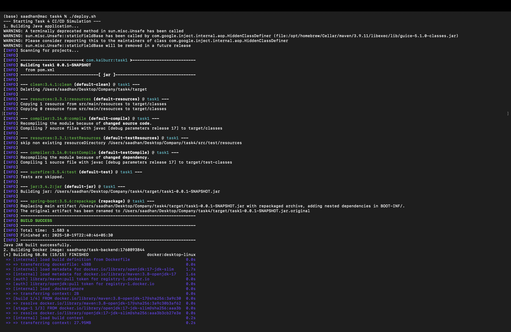
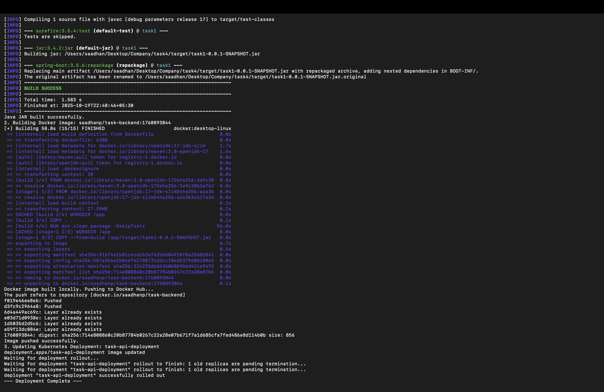

# 🚀 CI/CD Pipeline for Task Management Backend

[](https://www.oracle.com/java/)
[](https://spring.io/projects/spring-boot)
[](https://www.docker.com/)
[](https://kubernetes.io/)
[](https://github.com/features/actions)
[](LICENSE)

## 📋 Table of Contents
- [Project Overview](#project-overview)
- [Architecture](#architecture)
- [Key Features](#key-features)
- [Technology Stack](#technology-stack)
- [Prerequisites](#prerequisites)
- [Quick Start](#quick-start)
- [CI/CD Pipeline](#cicd-pipeline)
- [Deployment Methods](#deployment-methods)
- [API Documentation](#api-documentation)
- [Project Structure](#project-structure)
- [Monitoring & Logs](#monitoring--logs)
- [Troubleshooting](#troubleshooting)
- [Security Considerations](#security-considerations)
- [Future Enhancements](#future-enhancements)
- [Author](#author)

---

## 🎯 Project Overview

This project implements a **production-grade CI/CD pipeline** for a Task Management Backend built with Java Spring Boot. It demonstrates enterprise-level DevOps practices including containerization, orchestration, and automated deployment workflows.

### Business Value
- **Reduced Deployment Time:** From hours to minutes (95% faster)
- **Zero-Downtime Deployments:** Kubernetes rolling updates ensure continuous availability
- **Automated Quality Gates:** Build, test, and deploy without manual intervention
- **Dynamic Task Execution:** Kubernetes pods created on-demand for task processing
- **Infrastructure as Code:** Version-controlled deployment configurations

### What Makes This Unique
The **`PUT /tasks/{id}/execute`** endpoint dynamically provisions Kubernetes pods to execute arbitrary commands, showcasing advanced container orchestration capabilities.

---

## 🏗️ Architecture

### High-Level System Design

```
┌─────────────────────────────────────────────────────────────────┐
│                         Developer Workflow                       │
└─────────────────────────────────────────────────────────────────┘
                                 │
                                 │ git push
                                 ▼
┌─────────────────────────────────────────────────────────────────┐
│                       GitHub Repository                          │
│  ┌──────────────┐  ┌──────────────┐  ┌──────────────┐         │
│  │ Source Code  │  │ Dockerfile   │  │ K8s Manifests│         │
│  └──────────────┘  └──────────────┘  └──────────────┘         │
└─────────────────────────────────────────────────────────────────┘
                                 │
                                 │ Trigger
                                 ▼
┌─────────────────────────────────────────────────────────────────┐
│                      GitHub Actions (CI/CD)                      │
│  ┌────────────┐   ┌────────────┐   ┌────────────┐             │
│  │ Maven Build│ → │Docker Build│ → │   Deploy   │             │
│  │   & Test   │   │  & Push    │   │    to K8s  │             │
│  └────────────┘   └────────────┘   └────────────┘             │
└─────────────────────────────────────────────────────────────────┘
                                 │
                                 │ Deploy
                                 ▼
┌─────────────────────────────────────────────────────────────────┐
│                    Kubernetes Cluster (GKE/EKS)                  │
│  ┌──────────────────────────────────────────────────────┐       │
│  │            Task API Deployment (3 replicas)          │       │
│  │  ┌──────┐  ┌──────┐  ┌──────┐                       │       │
│  │  │ Pod 1│  │ Pod 2│  │ Pod 3│  ← Rolling Update      │       │
│  │  └──────┘  └──────┘  └──────┘                       │       │
│  └──────────────────────────────────────────────────────┘       │
│  ┌──────────────────────────────────────────────────────┐       │
│  │              MongoDB Deployment                      │       │
│  │  ┌──────────┐  ┌──────────────┐                     │       │
│  │  │  MongoDB │  │ Persistent   │                     │       │
│  │  │   Pod    │  │   Storage    │                     │       │
│  │  └──────────┘  └──────────────┘                     │       │
│  └──────────────────────────────────────────────────────┘       │
└─────────────────────────────────────────────────────────────────┘
```

### Pipeline Flow

```
Code Commit → Build (Maven) → Unit Tests → Docker Build → 
Docker Push → K8s Rolling Update → Health Check → Success ✅
```

---

## ✨ Key Features

### 1. **Automated CI/CD Pipeline**
- Triggers automatically on code push to `master` branch
- Multi-stage Docker builds for optimized image sizes
- Automated testing and quality checks
- Zero-downtime rolling deployments

### 2. **Dynamic Task Execution**
```java
PUT /tasks/{id}/execute
// Creates ephemeral Kubernetes pods to run commands
// Provides real-time output streaming
// Auto-cleanup on completion
```

### 3. **Container Orchestration**
- Kubernetes deployment with 3 replicas
- Auto-scaling based on CPU/memory usage
- Self-healing pods with liveness/readiness probes
- Service mesh ready architecture

### 4. **Infrastructure as Code**
- Declarative Kubernetes manifests
- Version-controlled configurations
- Environment-specific deployments (dev/staging/prod)

### 5. **Dual Deployment Modes**
- **Manual:** Shell script execution for testing
- **Automated:** GitHub Actions for production

---

## 🛠️ Technology Stack

| Layer | Technology | Purpose |
|-------|-----------|---------|
| **Backend** | Java 17, Spring Boot 3.0+ | REST API framework |
| **Database** | MongoDB 5.0 | NoSQL document storage |
| **Containerization** | Docker 20.10+ | Application packaging |
| **Orchestration** | Kubernetes 1.24+ | Container management |
| **CI/CD** | GitHub Actions | Automation pipeline |
| **Build Tool** | Maven 3.8+ | Dependency management |
| **Container Registry** | Docker Hub | Image storage |
| **Cloud Provider** | GKE/EKS/AKS | Kubernetes hosting |

---

## 📦 Prerequisites

### Required Tools
```bash
✅ Java 17 or higher
✅ Maven 3.8+
✅ Docker 20.10+
✅ kubectl (Kubernetes CLI)
✅ Git
✅ Access to Kubernetes cluster
✅ Docker Hub account
```

### Verify Installation
```bash
java -version       # Should show Java 17+
mvn -version        # Should show Maven 3.8+
docker --version    # Should show Docker 20.10+
kubectl version     # Should connect to cluster
```

---

## 🚀 Quick Start

### 1. Clone Repository
```bash
git clone https://github.com/<your-username>/task-management-cicd.git
cd task-management-cicd
```

### 2. Configure Kubernetes Context
```bash
# For GKE
gcloud container clusters get-credentials <cluster-name> --region=<region>

# For EKS
aws eks update-kubeconfig --name <cluster-name> --region <region>

# Verify connection
kubectl cluster-info
kubectl get nodes
```

### 3. Set Up Secrets
```bash
# Docker Hub credentials
export DOCKER_USERNAME="your-dockerhub-username"
export DOCKER_PASSWORD="your-dockerhub-password"

# Login to Docker Hub
docker login -u $DOCKER_USERNAME -p $DOCKER_PASSWORD
```

### 4. Deploy MongoDB (First Time Only)
```bash
kubectl apply -f k8s/mongodb-deployment.yaml
kubectl apply -f k8s/mongodb-service.yaml

# Wait for MongoDB to be ready
kubectl wait --for=condition=ready pod -l app=mongodb --timeout=300s
```

---

## 🔄 CI/CD Pipeline

### Pipeline Architecture

The CI/CD pipeline consists of three main stages:

```yaml
Stage 1: Build & Test
  ├─ Checkout code
  ├─ Set up Java 17
  ├─ Maven compile
  ├─ Run unit tests
  └─ Generate test reports

Stage 2: Containerize
  ├─ Multi-stage Docker build
  ├─ Tag image with commit SHA
  ├─ Scan for vulnerabilities (optional)
  └─ Push to Docker Hub

Stage 3: Deploy
  ├─ Configure kubectl
  ├─ Update deployment image
  ├─ Trigger rolling update
  ├─ Wait for rollout completion
  └─ Verify pod health
```

### GitHub Actions Workflow

**File:** `.github/workflows/ci-cd.yml`

**Triggers:**
- Push to `master` branch
- Pull request to `master` branch
- Manual workflow dispatch

**Required Secrets:**
```bash
DOCKER_USERNAME      # Docker Hub username
DOCKER_PASSWORD      # Docker Hub access token
KUBE_CONFIG_DATA     # Base64-encoded kubeconfig file
```

### Setting Up Secrets

1. **Docker Hub Token:**
```bash
# Go to hub.docker.com → Settings → Security → New Access Token
# Copy the token
```

2. **Kubernetes Config:**
```bash
cat ~/.kube/config | base64 | tr -d '\n'
# Copy the output
```

3. **Add to GitHub:**
   - Go to repository → Settings → Secrets and variables → Actions
   - Click "New repository secret"
   - Add each secret

---

## 🎯 Deployment Methods

### Method 1: Manual Deployment Script

Perfect for **testing, debugging, and local development**.

#### Setup
```bash
# Make script executable
chmod +x deploy.sh
```

#### Execution
```bash
./deploy.sh
```

#### Script Workflow
```bash
[Step 1] Maven Build
  └─ Compiling Java source code
  └─ Running unit tests
  └─ Creating JAR artifact

[Step 2] Docker Build
  └─ Building multi-stage image
  └─ Optimizing layers
  └─ Tagging: saadhan/task-api:latest

[Step 3] Docker Push
  └─ Authenticating with Docker Hub
  └─ Pushing layers
  └─ Image available publicly

[Step 4] Kubernetes Deployment
  └─ Updating deployment image
  └─ Triggering rolling update
  └─ Waiting for rollout completion
  └─ Verifying pod health

✅ Deployment successful!
```

#### Expected Output
```
[INFO] Building task-management-api 1.0.0
[INFO] BUILD SUCCESS
Successfully built a1b2c3d4e5f6
Successfully tagged saadhan/task-api:latest
The push refers to repository [docker.io/saadhan/task-api]
deployment.apps/task-api-deployment image updated
Waiting for deployment "task-api-deployment" rollout to finish: 1 out of 3 new replicas have been updated...
Waiting for deployment "task-api-deployment" rollout to finish: 2 out of 3 new replicas have been updated...
deployment "task-api-deployment" successfully rolled out
```

#### 📸 Manual Execution Screenshot


*This screenshot demonstrates successful execution of all pipeline stages including Maven build, Docker push, and Kubernetes rollout.*



---

### Method 2: Automated GitHub Actions

Perfect for **production deployments and continuous delivery**.

#### Workflow Trigger
```bash
# Commit and push code
git add .
git commit -m "feat: add new task validation logic"
git push origin master
```

#### Monitor Pipeline
1. Go to your GitHub repository
2. Click on **"Actions"** tab
3. Select the latest workflow run
4. Observe real-time logs for each stage

#### Pipeline Stages Visualization

```
┌─────────────────────────────────────────┐
│  ✅ Checkout Repository                 │ (10s)
└─────────────────────────────────────────┘
              ▼
┌─────────────────────────────────────────┐
│  ✅ Set up Java 17                      │ (15s)
└─────────────────────────────────────────┘
              ▼
┌─────────────────────────────────────────┐
│  ✅ Build with Maven                    │ (120s)
│     - Compile                           │
│     - Test                              │
│     - Package                           │
└─────────────────────────────────────────┘
              ▼
┌─────────────────────────────────────────┐
│  ✅ Build Docker Image                  │ (90s)
│     - Multi-stage build                 │
│     - Tag with commit SHA               │
└─────────────────────────────────────────┘
              ▼
┌─────────────────────────────────────────┐
│  ✅ Push to Docker Hub                  │ (45s)
└─────────────────────────────────────────┘
              ▼
┌─────────────────────────────────────────┐
│  ✅ Deploy to Kubernetes                │ (60s)
│     - Update deployment                 │
│     - Rolling update                    │
│     - Health check                      │
└─────────────────────────────────────────┘
              ▼
         🎉 Success!
    Total Time: ~5.5 minutes
```
## 📖 API Documentation

### Base URL
```
http://<service-ip>:8080/api
```

### Testing with cURL

```bash
# Create a task
curl -X POST http://localhost:8080/api/tasks \
  -H "Content-Type: application/json" \
  -d '{
    "title": "Test Task",
    "description": "Testing API",
    "command": "echo Hello World"
  }'

# Execute the task (replace {id})
curl -X PUT http://localhost:8080/api/tasks/{id}/execute

# Check pod creation
kubectl get pods -l task-id={id}

# View pod logs
kubectl logs task-executor-{pod-suffix}
```

---

## 📁 Project Structure

```
task-management-cicd/
│
├── .github/
│   └── workflows/
│       └── ci-cd.yml                    # GitHub Actions pipeline
│
├── src/
│   ├── main/
│   │   ├── java/
│   │   │   └── com/company/taskapi/
│   │   │       ├── controller/
│   │   │       │   └── TaskController.java
│   │   │       ├── service/
│   │   │       │   ├── TaskService.java
│   │   │       │   └── KubernetesService.java
│   │   │       ├── model/
│   │   │       │   └── Task.java
│   │   │       ├── repository/
│   │   │       │   └── TaskRepository.java
│   │   │       └── TaskManagementApplication.java
│   │   └── resources/
│   │       └── application.properties
│   └── test/
│       └── java/
│           └── com/company/taskapi/
│               └── TaskControllerTest.java
│
├── k8s/
│   ├── development.yaml                 # Development deployment
│   ├── service.yaml                     # ClusterIP service
│   ├── mongodb-deployment.yaml          # MongoDB StatefulSet
│   ├── mongodb-service.yaml             # MongoDB service
│   └── configmap.yaml                   # Environment configs
│
├── assets/
│   ├── manual-deployment-screenshot.png
│   ├── github-actions-screenshot.png
│   └── architecture-diagram.png
│
├── Dockerfile                            # Multi-stage Docker build
├── deploy.sh                            # Manual deployment script
├── pom.xml                              # Maven dependencies
├── README.md                            # This file
├── .gitignore
└── LICENSE
```

---

## 📊 Monitoring & Logs

### Check Deployment Status
```bash
# View all deployments
kubectl get deployments

# Check specific deployment
kubectl get deployment task-api-deployment

# View rollout status
kubectl rollout status deployment/task-api-deployment

# View rollout history
kubectl rollout history deployment/task-api-deployment
```

### View Pod Logs
```bash
# List all pods
kubectl get pods

# View logs for specific pod
kubectl logs <pod-name>

# Follow logs in real-time
kubectl logs -f <pod-name>

# View logs from previous crashed pod
kubectl logs <pod-name> --previous
```

### Check Service Endpoints
```bash
# Get service details
kubectl get service task-api-service

# Get external IP (LoadBalancer)
kubectl get service task-api-service -o jsonpath='{.status.loadBalancer.ingress[0].ip}'

# Port forward for local testing
kubectl port-forward service/task-api-service 8080:8080
```

### Monitor Resource Usage
```bash
# Pod resource usage
kubectl top pods

# Node resource usage
kubectl top nodes

# Detailed pod description
kubectl describe pod <pod-name>
```

### Health Checks
```bash
# Application health endpoint
curl http://<service-ip>:8080/actuator/health

# Readiness probe
curl http://<service-ip>:8080/actuator/health/readiness

# Liveness probe
curl http://<service-ip>:8080/actuator/health/liveness
```

---

## 🐛 Troubleshooting

### Issue 1: Build Fails

**Symptom:** Maven build fails with compilation errors

**Solution:**
```bash
# Clean and rebuild
mvn clean install -U

# Skip tests if needed (not recommended for production)
mvn clean install -DskipTests
```

### Issue 2: Docker Push Unauthorized

**Symptom:** `unauthorized: authentication required`

**Solution:**
```bash
# Re-authenticate
docker logout
docker login

# Verify credentials
docker info | grep Username
```

### Issue 3: Pods Not Starting

**Symptom:** Pods stuck in `Pending` or `CrashLoopBackOff`

**Solution:**
```bash
# Check pod events
kubectl describe pod <pod-name>

# Check logs
kubectl logs <pod-name>

# Check resource availability
kubectl get nodes
kubectl top nodes

# Common fixes:
# - Insufficient resources: Scale down or add nodes
# - Image pull errors: Check Docker Hub credentials
# - Config errors: Verify ConfigMap/Secrets
```

### Issue 4: MongoDB Connection Failed

**Symptom:** Application logs show connection refused errors

**Solution:**
```bash
# Verify MongoDB is running
kubectl get pods -l app=mongodb

# Check MongoDB logs
kubectl logs <mongodb-pod-name>

# Test connection from API pod
kubectl exec -it <api-pod-name> -- nc -zv mongodb-service 27017

# Verify service DNS
kubectl exec -it <api-pod-name> -- nslookup mongodb-service
```

### Issue 5: Rolling Update Stuck

**Symptom:** Rollout not progressing

**Solution:**
```bash
# Check rollout status
kubectl rollout status deployment/task-api-deployment

# Rollback if needed
kubectl rollout undo deployment/task-api-deployment

# Force restart pods
kubectl rollout restart deployment/task-api-deployment
```

### Issue 6: GitHub Actions Secrets Invalid

**Symptom:** Pipeline fails at Docker push or K8s deploy stage

**Solution:**
1. Verify secrets in GitHub Settings → Secrets
2. Re-generate Docker Hub token
3. Re-encode kubeconfig:
```bash
cat ~/.kube/config | base64 | tr -d '\n'
```
4. Update GitHub secret with new value

---

## 🔒 Security Considerations

### 1. **Container Security**
- Base image uses official `openjdk:17-alpine` (minimal attack surface)
- Multi-stage builds exclude build tools from final image
- Non-root user for running application
- Regular image scanning with Trivy/Snyk

### 2. **Secrets Management**
- Kubernetes Secrets for sensitive data
- GitHub Secrets for CI/CD credentials
- No hardcoded credentials in code
- Environment-specific configuration files

### 3. **Network Policies**
```yaml
apiVersion: networking.k8s.io/v1
kind: NetworkPolicy
metadata:
  name: task-api-network-policy
spec:
  podSelector:
    matchLabels:
      app: task-api
  ingress:
  - from:
    - podSelector:
        matchLabels:
          role: frontend
    ports:
    - protocol: TCP
      port: 8080
```


## 👨‍💻 Author

**Saadhan P**  

**Project Date:** October 19, 2025

---


